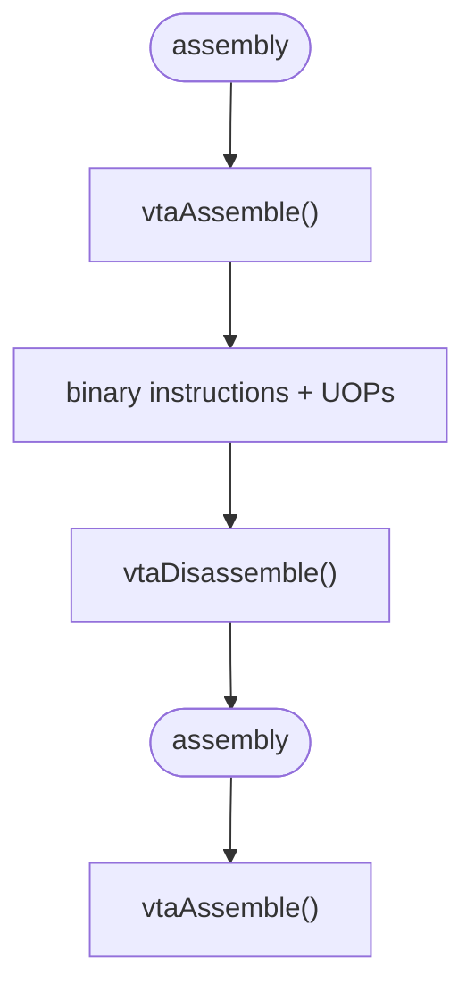

<div align="center">

# VTA Project

### VTA assembler / disassembler

A C library for assembling and disassembling instructions for the Versatile Tensor Accelerator (VTA).
The project is built upon the VTA hardware specification distributed 

C-based project which uses the API of TVM v0.18.0 to program the VTA simulator.

**Contents · Project structure · Public API · Supported instructions · Requirements · Clone · Build · Test**


</div>

## Contents

<ul>
  <li>VTA assembly parser</li>
  <li>Binary instruction generation</li>
  <li>VTA instruction disassembly</li>
  <li>UOP assembly and disassembly</li>
  <li>Dependency handling</li>
  <li>Round-trip support between assembly and binary representations</li>
  <li>Static library with a single public header</li>
  <li>Automated test suite</li>
</ul>

## Project structure

```bash
.
├── 3rdparty/
│   └── tvm/
├── include/
│   └── vta.h
├── src/
│   ├── assembler.c
│   ├── disassembler.c
│   ├── vtaError.c
│   └── tutorials/
├── tests/
│   └── test_runner.c
├── build.sh
└── README.md
```

The public interface of the library is exposed through

```c
#include <vta.h>
```

The detailed implementation is inside `/src`.


## Public API

### Assembler

```c
VTAErr vtaAssemble(
  const char     *asmCode,
  VTAGenericInsn *insnBuffer,
  int             maxInsn,
  int            *numInsn,
  VTAUop         *uopBuffer,
  int             maxUop,
  int            *numUop
);
```

`vtaAssemble(...)` converts textual VTA assemble into binary VTA instructions and UOPs.

The caller provides pre-allocated instruction and UOP buffers through their capacities.

On success:
<ul>
  <li> `numInsn` contains the number of generated instructions.</li>
  <li>`numUop` contains the number of generated UOPs.</li>
</ul>

### Disassembler
```c
VTAErr vtaDisassemble(
    const VTAGenericInsn   *insnBuffer,
    int                     numInsn,
    const VTAUop           *uopBuffer,
    int                     numUop,
    char                   *outBuffer,
    size_t                  outBufferSize
);
```

`vtaDisassemble(...)` converts binary VTA instructions and UOPs back into textual assembly.

The disassembler does not print directly to standard output. Generated assembly is written into the caller-provided outBuffer.

The number of valid UOPs is passed explicitly through numUop.

The API contract is:

```bash
numUop == 0  -> uopBuffer may be NULL
numUop > 0   -> uopBuffer must contain at least numUop valid elements
```

### Error reporting

```c
void vtaErrorPrint(VTAErr status, int lineNum);
```

The assembler and disassembler share the same VTAErr error type and the same error-reporting function.

## Supported instructions

### Simple instructions

```bash
NOOP
FINISH
```

### LOAD

```bash
LOAD(INP[4], MEM[100, 2, 8, 16])
LOAD(WGT[0], MEM[200, 1, 8, 8])
LOAD(ACC[0], MEM[300, 1, 8, 8])
LOAD(ACC_8BIT[0], MEM[300, 1, 8, 8])
LOAD(UOP[0], MEM[100, 4])
```

Supported VTA load memory types include:

```bash
UOP
WGT
INP
ACC
ACC_8BIT
```

Optional memory padding is supported:

```bash
LOAD(INP[4], MEM[100, 2, 8, 16]) PADDING(1, 1, 2, 2)
```

with padding order:

```bash
y_pad_0, y_pad_1, x_pad_0, x_pad_1
```

### Store

Both STORE and STOR are accepted by the assembler (STOR is the canonical, used by the assembler).

```bash
STORE(MEM[200, 2, 8, 16], ACC[5])
STOR(MEM[200, 2, 8, 16], ACC[5])
```

Optional padding is also supported:

```bash
STOR(MEM[200, 2, 8, 16], ACC[5]) PADDING(1, 1, 2, 2)
```

### UOPs

They are represented as three integer indices:

```bash
10, 20, 30
11, 21, 31
12, 22, 32
```

Labels define UOPs range:

```bash
lbl1_bgn:
10, 20, 30
11, 21, 31
12, 22, 32
lbl1_end:
```

### GEMM (FOR)

```bash
FOR (2, 4) UOP (lbl1_bgn, lbl1_end)
GEMM(ACC[0:3], INP[0:3], WGT[0:3])
```

Register reset is supported:

```bash
FOR (1, 6) UOP (lbl1_bgn, lbl1_end)
GEMM.RST(ACC[0:3])
```

GEMM loop factors can also be represented explicitly:

```bash
FOR (2, 4) UOP (lbl1_bgn, lbl1_end) FACTORS(1, 2, 3, 4, 5, 6)
GEMM(ACC[0:3], INP[0:3], WGT[0:3])
```

With the values meaning:

```bash
dst_factor_out
dst_factor_in
src_factor_out
src_factor_in
wgt_factor_out
wgt_factor_in
```

### ALU

Supported ALU operations are:

```bash
ALU.MIN
ALU.MAX
ALU.ADD
ALU.SHR
ALU.MUL
```

Immediate form:

```bash
FOR (3, 5) UOP (lbl1_bgn, lbl1_end)
ALU.ADD(DST[0:3], -7)
```

Source form:

```bash
FOR (3, 5) UOP (lbl1_bgn, lbl1_end)
ALU.MAX(DST[0:3], SRC[0:3])
```

ALU loop factors are supported:

```bash
FOR (3, 5) UOP (lbl1_bgn, lbl1_end) FACTORS(1, 2, 3, 4)
ALU.ADD(DST[0:3], -7)
```

With the values corresponding to:

```bash
dst_factor_out
dst_factor_in
src_factor_out
src_factor_in
```

### Dependencies

VTA pipeline dependencies can be expressed with POP and PUSH.

e.g.

```bash
POP (LD->EX, ST->EX)

FOR (2, 4) UOP (lbl1_bgn, lbl1_end)
GEMM(ACC[0:3], INP[0:3], WGT[0:3])

PUSH (EX->LD, EX->ST)
```

```bash
POP (EX->LD)
LOAD(INP[4], MEM[100, 2, 8, 16])
PUSH (LD->EX)
```

```bash
POP (EX->ST)
STOR(MEM[200, 2, 8, 16], ACC[5])
PUSH (ST->EX)
```

## Round-trip support

The generated disassembly is designed to be accepted again by the assembler.



## Requirements

<ul>
  <li>GCC</li>
  <li>CMake</li>
  <li>Ninja</li>
  <li>Python 3</li>
  <li>LLVM 14</li>
  <li>Git</li>
</ul>

The project includes Apache TVM as a Git submodule.

## Clone

Clone the repository together with its submodules:

```bash
git clone --recurse-submodules <repository-url>
cd VTA
```

If the repository was cloned without submodules:

```bash
git submodule update --init --recursive
```

## Build

Run:

```bash
./build.sh
```

The build script:

<ol>
  <li>Configure and build TVM with the VTA simulator when necessary</li>
  <li>Compile the assembler, disassembler, and shared error implementation</li>
  <li>Create static library  </li>
  
  ```bash
  build/libvta.a
  ```

  <li>Compile `tests/test_runner.c` </li>
  <li>Link the test executable against `libvta.a` </li>
  <li>Run the test suite</li>
</ol>

## Static library

Client code only needs the public header:

```c
#include "vta.h"
```

linked to `build/libvta.a`.

e.g. for assembler:

```c
VTAGenericInsn insnBuffer[64];
VTAUop uopBuffer[64];

int numInsn = 0;
int numUop = 0;

const char *code =
    "LOAD(INP[4], MEM[100, 2, 8, 16])\n"
    "FINISH\n";

VTAErr status = vtaAssemble(
    code,
    insnBuffer,
    64,
    &numInsn,
    uopBuffer,
    64,
    &numUop
);

if (status != VTA_OK)
    vtaErrorPrint(status, -1);
```

e.g. for disassembler:

```c
char output[4096];

VTAErr status = vtaDisassemble(
    insnBuffer,
    numInsn,
    uopBuffer,
    numUop,
    output,
    sizeof(output)
);

if (status == VTA_OK)
    printf("%s", output);
else
    vtaErrorPrint(status, -1);
```

## Test

All assembler and disassembler tests are collected in:

```bash
tests/test_runner.c
```

The test suite is executed automatically by `build.sh` .
